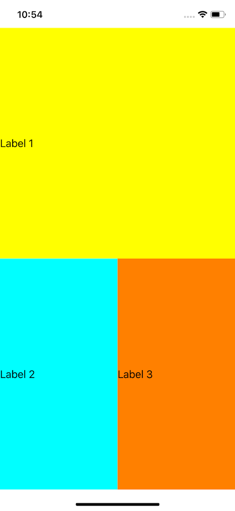

# Swift Component Architecture
Inspired by React JS.

## Demo

```swift
class CustomComponent: Component {
    typealias State = Void
    required init(props: Void) {}

    func render() -> UIView {
        return .stack(children: [
            .label(.init(text: "Label 1", backgroundColor: .yellow)),
            .stack(.init(axis: .horizontal), children: [
                .label(.init(text: "Label 2", backgroundColor: .cyan)),
                .label(.init(text: "Label 3", backgroundColor: .orange))
            ])
        ])
    }
}
```

